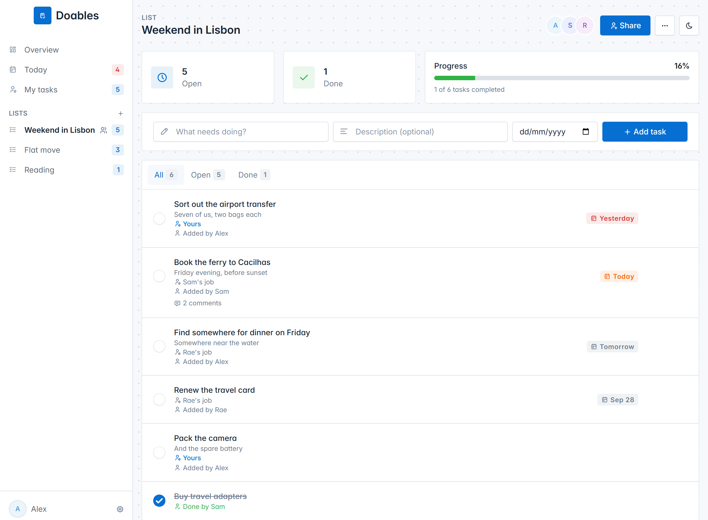
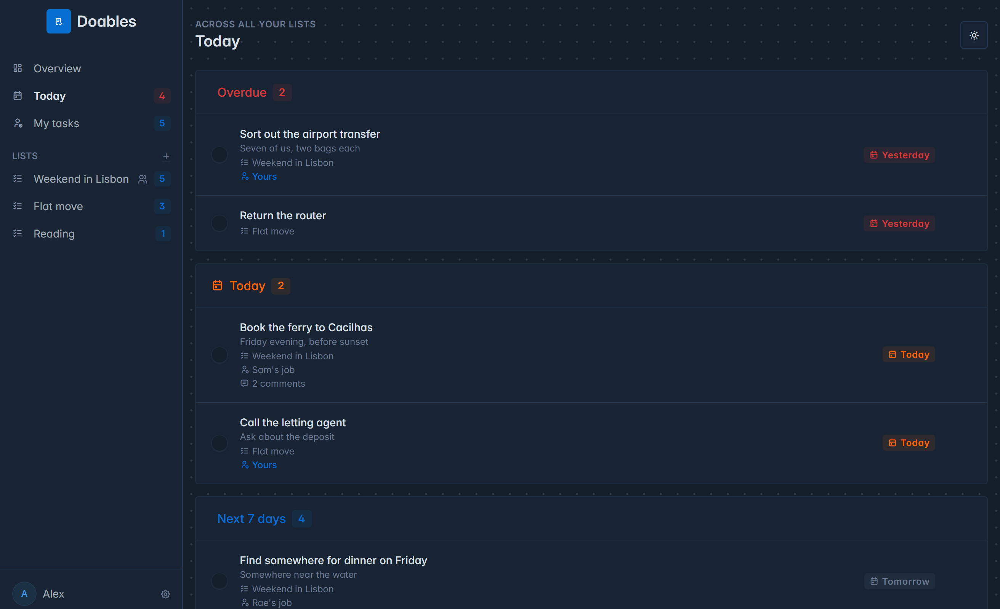
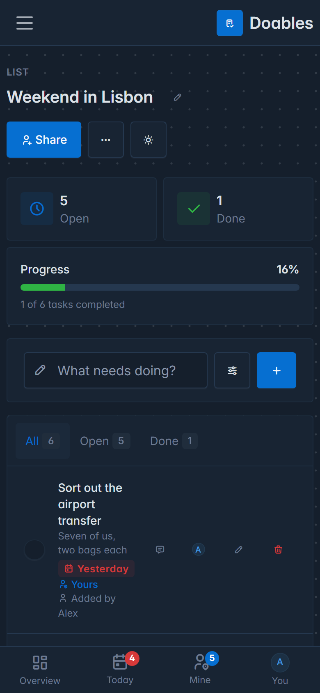
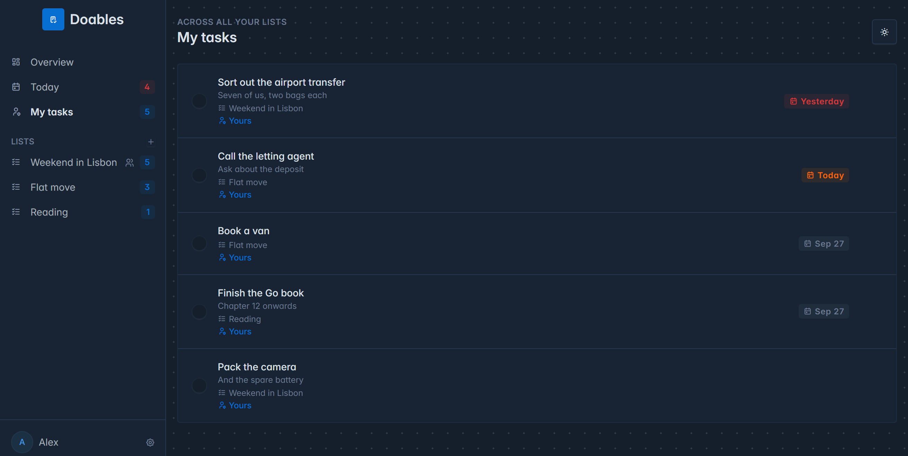

# Doables

[](https://github.com/ReDCLiF-Unknow/doables/actions/workflows/ci.yml)
[](https://github.com/ReDCLiF-Unknow/doables/releases)
[](https://github.com/ReDCLiF-Unknow/doables/releases)
[](LICENSE)

A small to-do list app you can share: Go, SQLite, `html/template`, and the [Tabler](https://tabler.io) UI + Tabler Icons.
Includes a CLI (Cobra + Resty) that talks to the server's JSON API.

One binary serves everything, including its own CSS, JavaScript and fonts, so a page load
reaches nothing but your own server: no CDN learns who is using your lists, and the app works
on a network with no way out.

<picture>
  <source media="(prefers-color-scheme: dark)" srcset="docs/list-dark.png">
  
</picture>

<table>
<tr>
<td width="62%"></td>
<td width="38%"></td>
</tr>
<tr>
<td><em>Today, across all your lists</em></td>
<td><em>On a phone</em></td>
</tr>
<tr>
<td colspan="2"></td>
</tr>
<tr>
<td colspan="2"><em>My tasks: what other people have made your job</em></td>
</tr>
</table>

## Install

**Docker** — the image carries both binaries and nothing else is needed:

```
docker run -d --name doables -p 8080:8080 -v doables:/data ghcr.io/redclif-unknow/doables:latest
```

Or with the [compose file](compose.yaml): `docker compose up -d`. The database lives in the `/data`
volume, so it survives upgrades. Images are built for amd64 and arm64, so a Raspberry Pi works too.

`:latest` is the newest release; pin a version instead (`:v1.0.0`) if you'd rather upgrade
deliberately. `:main` is built from the development branch and is not promised to work.

**A prebuilt binary** — download the archive for your system from the
[latest release](https://github.com/ReDCLiF-Unknow/doables/releases/latest), unpack it, and run
`doables-server`. There is nothing to install alongside it: the database is a SQLite file created
on first run, with its write-ahead log beside it while the server is running.

Either way, open <http://localhost:8080> and pick a name.

## A public demo

To let people try Doables without installing anything, run a separate server in demo mode:

```
docker run -d --name doables-demo -p 8081:8080 -e DOABLES_DEMO=1 -v doables-demo:/data ghcr.io/redclif-unknow/doables:latest
```

(or `doables-server -demo`). Everyone who picks a name lands in their own filled-in copy of some example
lists, shared with two pretend teammates, rather than on an empty page. Nobody sees anybody else's, so
there is nothing to moderate, and each one is deleted 24 hours after its visitor arrived. The banner on
every page says so, and suggests opening the Share link in a private window to watch two people work on
one list.

**Give the demo a database of its own.** Demo mode deletes every account a day after it was made, so it
refuses to start on a database that already has accounts in it, rather than deleting them.

## Run from source

```
go run ./cmd/server            # http://localhost:8080, database in ./doables.db
go run ./cmd/server -addr localhost:9000 -db /path/to/doables.db
```

SQLite is provided by the pure-Go `modernc.org/sqlite`, so no C compiler is needed. It runs in
write-ahead logging mode, so reading carries on while somebody writes; back the database up with
`sqlite3 doables.db ".backup out.db"` or while the server is stopped, rather than copying the file
from under it. Databases from earlier versions are upgraded automatically on start-up.

The stylesheets, scripts and fonts live in `internal/web/static/vendor/` and are compiled into
the binary, so building needs nothing but Go. To change a version, edit the numbers at the top of
[tools/vendor/fetch.py](tools/vendor/fetch.py) and run it; it re-downloads them and cuts the icon
font down to the icons the templates actually use (8KB rather than 844KB).

## Working with tasks

- **Edit anything.** Hover a task and click the pencil to change its title, description or due date in place
  (Esc cancels). Click the pencil next to a list's name to rename it.
- **Whose job it is.** On a shared list, the person icon on a task opens a menu of everyone on it;
  pick a name and the task says so. Only members can be given work, and removing someone from a list
  frees whatever was theirs. **My tasks** in the sidebar gathers everything assigned to you across all
  your lists, with a count beside it; finishing something takes it off that list without forgetting
  who did it.
- **Talk about a task.** The speech bubble on a task opens its comments: who said what, and when. Unlike
  the description, which anyone can overwrite, comments only add up; you can delete your own, nobody else's.
  A task shows how many it has everywhere, and the conversation itself on the list's page. New comments
  appear as they are written, and a half-typed one is never lost to someone else's change.
- **Due dates.** Optional on every task. Tasks show a badge ("Today", "Tomorrow", red "Overdue · Sep 17"), and
  open tasks sort soonest-due first.
- **Today view.** The **Today** item in the sidebar gathers every open task with a due date across all your
  lists: **Overdue**, **Today** and **Next 7 days**. Its badge counts what is overdue or due today (red when
  something is overdue). "Today" is the server's local date.
- **Undo delete.** Deleting a task shows a "Task deleted · Undo" toast, and so does deleting a whole list,
  which takes its tasks and members with it. Either can be brought back for a day, after which it is purged.
  Only the list's owner can undo a deleted list.
- **Live and in place.** Ticking, adding, editing and deleting don't reload the page, and changes made by other
  people (or the CLI) appear on your screen within a moment, via server-sent events (`/events`). If you're in
  the middle of editing something, that part waits until you're done so nothing you're typing is overwritten.

## On your phone

The layout adapts to the screen: on phones and tablets the sidebar becomes a hamburger menu and a **bottom tab bar**
(Overview, Today with its badge, and your profile) appears; quick-add is a single line with a details button for the
description and due date; touch targets are at least 44px; inputs are 16px so iPhones don't zoom in when you tap them.

It is also **installable**: in Chrome/Edge choose *Install*, on iOS Safari *Share → Add to Home Screen*. You get an icon and a
window without browser chrome. There is no service worker, so it needs a connection to your server (it is not usable
offline). Installing from a non-`localhost` address needs HTTPS.

## Sharing lists with other people

There are no passwords. The first time someone opens the app they pick a **display name**; the server
gives their browser a secret token (in an `HttpOnly` cookie; only a hash is stored server-side).

- Every list you create is **private** to you. Click **Share** on a list to get its **invite link**.
- Anyone who opens the link, picks a name and clicks **Join list** becomes a member: they can add, edit, tick
  off and delete tasks, assign them, and rename the list. Tasks show who added them, who they are for, and
  who finished them.
- The **owner** can remove members, create a new invite link (which stops the old one working) and delete
  the list. Members can leave.
- Lists created before sharing existed are **public**: they have no owner, so anyone who can reach the
  server sees and edits them. Open one and click **Claim this list** to make it private. A public list has
  no members, so nothing in it can be assigned until somebody claims it. New lists are never public: making
  one needs a token, so it always belongs to somebody.
- **Profile** (bottom of the sidebar) lets you rename yourself and shows your token. Paste it on another
  device ("Already use Doables on another device?") to sign in as yourself there. Clearing your cookies
  without saving the token means losing that identity, with no password to reset and no email to send,
  so every page says so until you have saved it (copying it counts).

Anyone holding an invite link can join, so treat it like a password and reset it if it leaks. If you expose
the server beyond your own network, put it behind HTTPS so tokens and cookies are protected. If you put it
behind a reverse proxy, don't let the proxy buffer `/events` (the server sends `X-Accel-Buffering: no` for nginx).

## CLI

```
go build -o doables ./cmd/doables

doables register "Alex"        # create an identity; prints a token
export DOABLES_TOKEN=<token>   # PowerShell: $env:DOABLES_TOKEN = "<token>"

doables new-list "Groceries"
doables add 1 "Buy milk" -d "2 litres" --due 2026-10-01
doables tasks 1
doables edit 3 --title "Buy oat milk" --due 2026-10-05   # only the flags you give are changed
doables edit 3 --due ""                                  # clear the due date
doables assign 3 2    # give task 3 to member 2 (see `doables members`)
doables assign 3 me   # ...or to yourself; `doables assign 3 none` frees it again
doables mine          # everything assigned to you, across every list
doables done 1        # or: doables undone 1
doables lists
doables rename-list 1 "Weekly shop"
doables rm 1          # delete task
doables rm-list 1     # delete list and its tasks (owner only)
doables restore-list 1   # undo that, within a day

doables comment 3 "Friday, 7pm?"   # say something about task 3
doables comments 3                 # read the conversation
doables rm-comment 12              # delete one of your own

doables invite 1                       # print the invite link for a list
doables join http://host:8080/join/CODE   # join a list (link or bare code)
doables members 1
doables whoami
```

Use `-s http://host:port` / `DOABLES_SERVER` to pick the server (default `http://localhost:8080`) and
`-t TOKEN` / `DOABLES_TOKEN` for your identity. Without a token you act anonymously: you can see and edit
public lists, but not create a list, since it would belong to nobody. If you already have a token from the
web UI's Profile window, use that one instead of registering.

## JSON API

Send `Authorization: Bearer <token>` to act as a person. Lists you can't see return `404`.
Dates are `YYYY-MM-DD`.

| Method | Path | Body |
|---|---|---|
| POST | `/api/users` | `{"name": "..."}` → `{id, name, token}` |
| GET | `/api/me` | |
| POST | `/api/join/{code}` | |
| GET | `/api/mine` | open tasks assigned to you, across every list |
| GET | `/api/lists` | |
| POST | `/api/lists` | `{"name": "..."}`; needs a token, so the list has an owner |
| PATCH | `/api/lists/{id}` | `{"name": "..."}` (any member) |
| DELETE | `/api/lists/{id}` | owner only; the list can be restored for a day |
| POST | `/api/lists/{id}/restore` | owner only, within a day of deleting it |
| GET | `/api/lists/{id}/members` | |
| GET | `/api/lists/{id}/tasks` | |
| POST | `/api/lists/{id}/tasks` | `{"title": "...", "description": "...", "due_date": "..."}` |
| PATCH | `/api/tasks/{id}` | any of `{"done": true, "title": "...", "description": "...", "due_date": "...", "assignee_id": 2}`; `"due_date": ""` clears the date and `"assignee_id": 0` clears the assignee |
| DELETE | `/api/tasks/{id}` | moves the task to the trash |
| GET | `/api/tasks/{id}/comments` | oldest first |
| POST | `/api/tasks/{id}/comments` | `{"body": "..."}`, up to 500 characters; needs a token |
| DELETE | `/api/comments/{id}` | your own only |

## Tests

```
go test ./...
```

Every push and pull request runs the same tests on GitHub, along with `gofmt`, `go vet`,
a cross-compile of each released platform, and a build of the Docker image. The CLI is
tested the way it is used: each command runs against a real server and its output is read
back. CI also starts the built container, uses it, and stops it, so the image is known to
work rather than merely to compile.

The screenshots above are generated rather than taken by hand, so they can be redone
whenever the UI changes:

```
python tools/screenshots/shoot.py
```

It starts a server on a spare port, fills it with a shared list, photographs it with
headless Chrome and writes the PNGs into `docs/`, cleaning up after itself. It needs Go,
Chrome and `python -m pip install websockets`.

## Who is downloading it

Two different numbers, measuring two different things:

**Release downloads** — how many times a built archive was fetched. GitHub counts these permanently
and publicly; the badge at the top is that total. To see the breakdown per file:

```
gh api repos/ReDCLiF-Unknow/doables/releases --jq '.[].assets[] | "\(.download_count)\t\(.name)"'
```

**Clones and views** — people fetching the source or looking at the repo page. GitHub shows these
under *Insights → Traffic*, but only for the last 14 days and only to the repo owner. To check right now:

```
gh api repos/ReDCLiF-Unknow/doables/traffic/clones --jq '"\(.count) clones, \(.uniques) unique"'
gh api repos/ReDCLiF-Unknow/doables/traffic/views  --jq '"\(.count) views, \(.uniques) unique"'
```

The weekly [traffic workflow](.github/workflows/traffic.yml) appends them to
[stats/traffic.csv](stats/traffic.csv) so that history is not lost. It needs a token of its own:
the traffic API requires push access, and the token Actions provides cannot be granted it. Once, to
enable it:

1. Create a token at <https://github.com/settings/tokens> — classic with `repo` scope, or
   fine-grained limited to this repository with *Administration: read-only*.
2. Add it to the repo: `gh secret set TRAFFIC_TOKEN --repo ReDCLiF-Unknow/doables`
   (it will prompt for the value, so the token stays out of your shell history).
3. Check it works: `gh workflow run traffic.yml --repo ReDCLiF-Unknow/doables`

Without that secret the workflow skips quietly instead of failing every week.

Two caveats, so the numbers aren't read as more than they are. Bots clone public repositories
constantly, especially in the hours after one first appears, so early clone counts are mostly
automated rather than people. And `unique` is counted per day, so the same person returning on two
days is counted twice; summed totals are a floor on interest, not a headcount.

Nothing is tracked inside the app itself. A server you run never reports anything to anyone.

## Licence

[MIT](LICENSE) — use it, change it, share it, sell it; just keep the copyright notice.

It stands on other people's open source work: [Tabler](https://tabler.io) and
[Resty](https://github.com/go-resty/resty) (MIT), [Cobra](https://github.com/spf13/cobra) (Apache 2.0),
and [modernc.org/sqlite](https://gitlab.com/cznic/sqlite) (BSD-3-Clause). Tabler's CSS and icons and
the [Inter](https://rsms.me/inter/) typeface (SIL Open Font License 1.1) are redistributed inside the
binary; their licences sit beside them in
[internal/web/static/vendor](internal/web/static/vendor).
